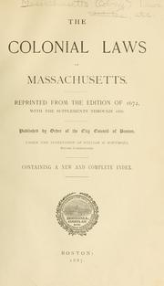
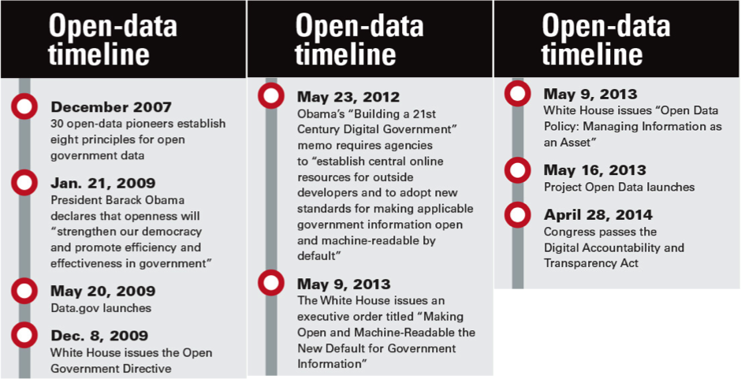
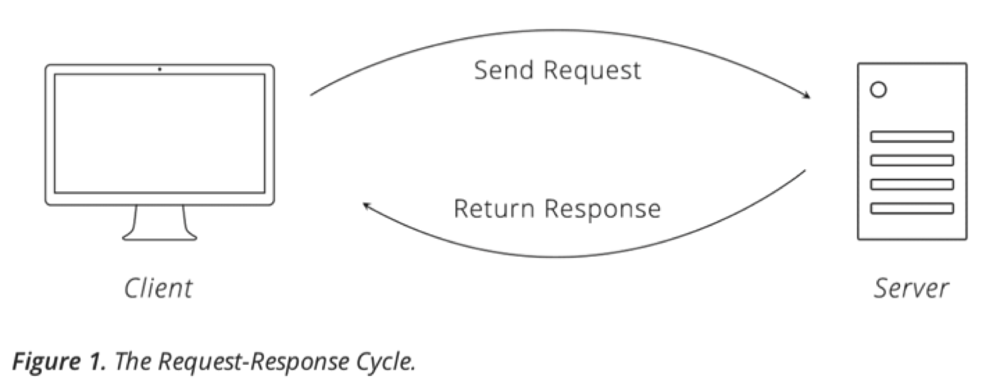
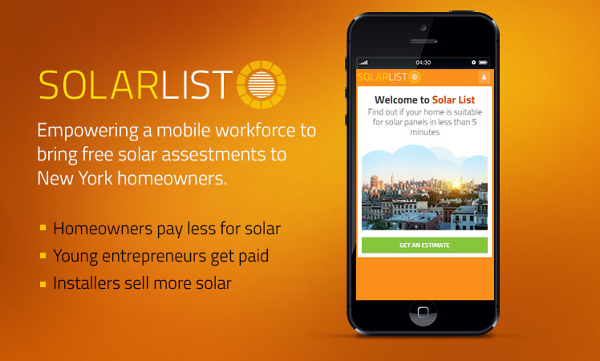
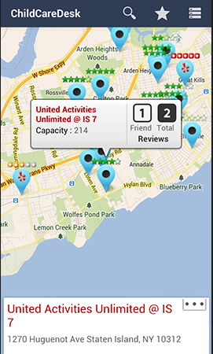

class:center,middle

# History and Practice of Open Data
## All in 30 minutes (or so...)
### Richard Dunks
### Follow along: http://bit.ly/NewSchoolBigData

History and Practice of Open Data by <a xmlns:cc="http://creativecommons.org/ns#" href="https://www.datapolitan.com" property="cc:attributionName" rel="cc:attributionURL">Richard Dunks</a> is licensed under a <a rel="license" href="http://creativecommons.org/licenses/by-nc-sa/4.0/">Creative Commons Attribution-NonCommercial-ShareAlike 4.0 International License</a>.

---

class:center,middle

---

# Goals for this evening
--

+ Discuss the history of open data
--

+ Discuss the main elements of open data
--

+ Discuss important tools when working with open data
--

+ Discuss meaningful uses of open data

---

# Introductions
+ Name
+ Program
+ One thing you associate open data

---

class:center,middle
# Quick History of Open Data

---

# Why do we publish laws?

---

class:center,middle
# What good are laws if we don't know how they're implemented?
## &nbsp;

---

class:center,middle
# What good are laws if we don't know how they're implemented?
## Which is what data tells us

---

class:center,middle

Source: [Meet the Fire Hydrant that Unfairly Nets NYC $25,000 a Year](http://iquantny.tumblr.com/post/83696310037/meet-the-fire-hydrant-that-unfairly-nets-nyc)

---
class:center,middle

# Modern History of Open Data

Source: http://fcw.com/articles/2014/06/09/exec-tech-brief-history-of-open-data.aspx?admgarea=TC_ExecTech

---

# Contributors to the Open Data Movement
--

+ Open science
--

+ Open-source software

---
class:center,middle

Source: <a target='_blank' href='http://www.paulvanslembrouck.com?utm_source=visually_embed'>ptvan</a>

---

class: center, middle

# What is Open Data?

---

class: middle, center
> Open data is data that can be freely used, shared and built-on by anyone, anywhere, for any purpose

## [Open Knowledge Foundation](http://blog.okfn.org/2013/10/03/defining-open-data/)

---

# Key Features of Open Data
--

+ Availability and access
--

+ Reuse and redistribution
--

+ Universal participation

---

# Benefits of Open Data
--

+ Transparency
--

+ Releasing social and commercial value
--

+ Participation and engagement

---
class:center,middle
# Concerns with Open Data

---

# Reliability
--

+ Veracity of source
--

+ Currency of data

---

# Privacy
--

+ Personally identifiable information (PII)
--

+ Mosaic Effect

---

# Confidentiality
--

+ Proprietary information
--

+ Trade secrets
--

+ Government procurement information

---

# Security
--

+ Identify sensitive infrastructure
--

+ Describe methods and procedures

---

class:center,middle
# Open Data Sources
## &nbsp;

---

class:center,middle
# Open Data Sources
## In order of usability

---

# Open Data Portals

---

# Application Program Interface (API)

---

# Application Program Interface (API)

---

# Web Scraping

[Introduction to web scraping by Thomas Levine](http://thomaslevine.com/dada/web-sites-to-data-tables/)
---

# Web Scraping

[Web Scraping with OpenRefine video from Eric Brelsford](http://www.youtube.com/watch?v=KQlCTo0Q71Q)

---

class:middle,center

# If it's online, you can get the data
## &nbsp;

---

class:middle,center

# If it's online, you can get the data
## Trust me

---

class:middle,center

Source: http://arstechnica.com/tech-policy/2010/03/why-google-makes-it-easy-to-leave-google/

---

# [OpenStreet Maps](https://www.openstreetmap.org/)
--

+ Open map data
--

+ [Wikipedia of maps](http://www.youtube.com/watch?v=cASrJJ2lsBQ)
--

+ Anyone can contribute to (but [read the wiki](http://wiki.openstreetmap.org/wiki/Beginners%27_Guide) first)

---

class:center,middle
# Open Data Tools

---

# Common Tools
--

+ Microsoft Excel
--

+ Microsoft PowerPoint
--

+ Google Maps
--

+ ESRI ArcGIS
--

+ [Tableau](https://public.tableau.com/s/) ([example](https://public.tableau.com/s/gallery/history-dow-30))

---

class:center,middle

---

# Common (Open-Source) Tools

--

+ [OpenOffice](http://www.openoffice.org/)/[NeoOffice](https://www.neooffice.org/neojava/en/index.php)/[LibreOffice](https://www.libreoffice.org/)
--

+ [OpenRefine](http://openrefine.org/)
--

+ [QGIS Open-Source GIS](http://qgis.org/)
--

+ [CartoDB](https://cartodb.com/) ([Twitter Sunrise Example](http://cartodb.s3.amazonaws.com/static_vizz/sunrise.html?title=true&description=true&search=false&shareable=true&cartodb_logo=true&layer_selector=false&legends=false&scrollwheel=true&sublayer_options=1%7C1&sql=&zoom=2&center_lat=22.917922936146045&center_lon=51.328125#))
--

+ [R](https://www.r-project.org/)/[RStudio](https://www.rstudio.com/)
--

+ [Python](https://www.python.org/)
--

+ JavaScript ([jQuery](https://jquery.com/), [D3](d3js.org), [Leaflet.js](http://leafletjs.com/))
--

+ [Github](http://github.com)

---

class:middle,center
# And more are being created all the time...
## &nbsp;

---

class:middle,center
# And more are being created all the time...
## ...and there's plenty I'm forgetting

---

class: center,middle

# What can be done with open data?

---

# Examples

+ [Pediacities Vision Zero Map](http://nyc.pediacities.com/fsmaps/VisionZero/)
+ [Living Lots NYC (formerly 596 Acres)](http://livinglotsnyc.org/)
+ [Twitter NYC: A Multilingual City](http://ny.spatial.ly)
+ [NYC Taxis: A Day in the Life](http://nyctaxi.herokuapp.com/)
+ [Wikipedia Worldview](http://www.wikipediaworldview.net/)

---

# Other Examples

---

# Other Examples

---

# Some Things I've Done with Open Data
+ [UN Comtrade Visualization](http://richarddunks.github.io/)
+ [Corridorscope](http://www.corridorscope.com)
+ [Rudin Center Job Access](http://www.datapolitan.com/job_access/)
+ [Subway Transit Sheds in NYC](http://richard-datapolitan.cartodb.com/viz/c0d4f39e-962e-11e4-9b3b-0e9d821ea90d/embed_map)
+ [MTA Subway Station Status](http://www.datapolitan.com/mta_station_repair_status/)
+ [Citibike Dock Status Twitter Bot](https://twitter.com/CitiBikedocks)

---
class: center, middle

# What can _you_ do with open data?

<h3>&nbsp;</h3>

---
class: center, middle

# What can _you_ do with open data?

<h3>Hopefully you're going to find out in this course</h3>

---

class:center,middle
# Resources

---

## History of Open Data
+ Tauberer, Joshua, Open Government Data: The Book ["Ancient Origins of Open Access to Laws"](https://opengovdata.io/2014/ancient-origins-open-access-to-law/)
+ Chignard, Simon, "[A brief history of open data](http://www.paristechreview.com/2013/03/29/brief-history-open-data/)" ParisTech Review

---

## Open Data Tools
+ [Open Data Tools](http://opendata-tools.org/)
+ [Kimono Labs](https://www.kimonolabs.com/) web scraper
+ [ScraperWiki](https://scraperwiki.com/)

---

# Thank You
+ [richard@datapolitan.com](mailto:richard@datapolitan.com)
+ http://blog.datapolitan.com
+ [@rdunks1](https://twitter.com/rdunks1)/[@datapolitan](https://twitter.com/Datapolitan)

---

class:center,middle
# Now let's have some fun
http://chriswhong.github.io/plutoplus/#